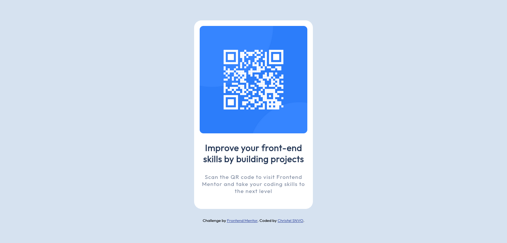

# Frontend Mentor - QR code component solution

This is a solution to the [QR code component challenge on Frontend Mentor](https://www.frontendmentor.io/challenges/qr-code-component-iux_sIO_H). Frontend Mentor challenges help you improve your coding skills by building realistic projects. 

## Table of contents

- [Overview](#overview)
  - [Screenshot](#screenshot)
  - [Links](#links)
- [My process](#my-process)
  - [Built with](#built-with)
- [Author](#author)

**Note: Delete this note and update the table of contents based on what sections you keep.**

## Overview

### Screenshot

***screenshot-qr-code-component-desktop***

 
***screenshot-qr-code-component-mobile***

### Links

- Solution URL: [frontendmentor link](https://www.frontendmentor.io/solutions/htmlcss-qr-code-solution-Jh7nki7tB5)
- Live Site URL: [Github link](https://sylva2002.github.io/qr-code-component-html-css/)

## My process

### Built with

- Semantic HTML5 markup
- CSS custom properties
- Flexbox
- Mobile-first workflow

## Author

- GitHub - [Sylva2002](https://github.com/Sylva2002)
- Frontend Mentor - [@Sylva2002](https://www.frontendmentor.io/profile/Sylva2002)
